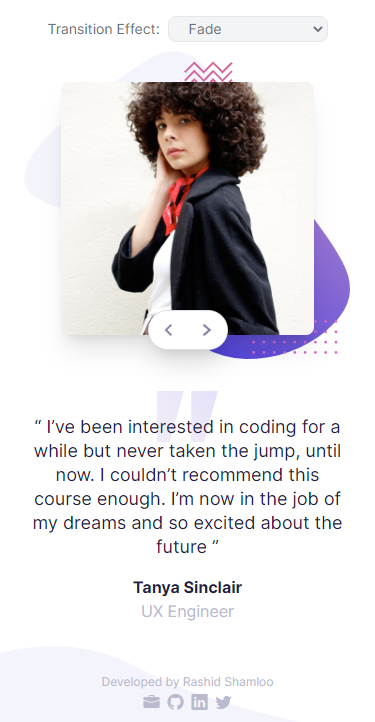

# Front End Mentor - Project 029 - Coding Bootcamp Testimonials Slider

This is a solution to the [Coding Bootcamp Testimonials Slider challenge on Frontend Mentor](https://www.frontendmentor.io/challenges/coding-bootcamp-testimonials-slider-4FNyLA8JL).

## Table of contents

- [Overview](#overview)
  - [Screenshot + Video](#screenshot--video)
  - [Links](#links)
- [My process](#my-process)
  - [Built with](#built-with)
  - [What I learned](#what-i-learned)
  - [Useful resources](#useful-resources)
- [Author](#author)

## Overview

### Screenshot + Video

- Desktop

https://user-images.githubusercontent.com/121501991/227598366-4fe44502-24a6-4a3c-9563-6a30d9692a6f.mp4

- Mobile

https://user-images.githubusercontent.com/121501991/227599266-6f63d7d5-d011-4c1d-81f3-ad76e25610a8.mp4

### Links

- Solution URL: https://github.com/rashidshamloo/fem_029_coding-bootcamp-testimonials-slider/
- Live Site URL: https://rashidshamloo.github.io/fem_029_coding-bootcamp-testimonials-slider/

## My process

### Built with

- Vite / React.js
- TypeScript
- Framer Motion
- Tailwind CSS
- Semantic HTML5 markup

### What I learned

- Using TypeScript with React.js
- Using interfaces for component props in TypeScript
- Implementing components that wrap around other elements and take them as a `prop` (children)
- Iterating through component children and modifying/adding to their `props`
- Using `React.cloneElement`, `React.isValidElement`, `React.ReactNode` and `React.Children` in TypeScript
- Debugging (Googling) TypeScript errors (lots of them!) and learning from them
- Using Event Listeners that change the state in React components inside the `useEffect()` hook
- Detecting swipe left/right from a touch device using `react-swipeable` hook
- Using `bg-[length:]` to set arbitrary value for background size in Tailwind CSS
- Why `margin-top` moves the parent down (margin collapsing) instead of leaving an empty space and how to fix it (`overflow:auto;` on parent)
- Using `Framer Motion` animation library with React.js
- Using `variants` in Framer Motion
- Using `<AnimationPresence>` in Framer Motion to keep animating components when they're removed from the DOM
- Using `useRef()` hook in TypeScript
- Adding custom breakpoints in Tailwind CSS

### Useful resources

- [Framer Motion](https://www.framer.com/) - The animation library i used in this challenge
- [React Swipeable](https://www.npmjs.com/package/react-swipeable) - The hook i used for touch/swipe functionality
- [How to update state inside event listeners](https://stackoverflow.com/questions/53845595/wrong-react-hooks-behaviour-with-event-listener)
- [How to fix margin collapse of parent element when the child has margin-top](https://stackoverflow.com/a/1939980)
- [How to use `useRef()` hook in TypeScript](https://stackoverflow.com/a/70733258)

## Author

- Frontend Mentor - [@rashidshamloo](https://www.frontendmentor.io/profile/rashidshamloo)
- Twitter - [@rashidshamloo](https://www.twitter.com/rashidshamloo)
